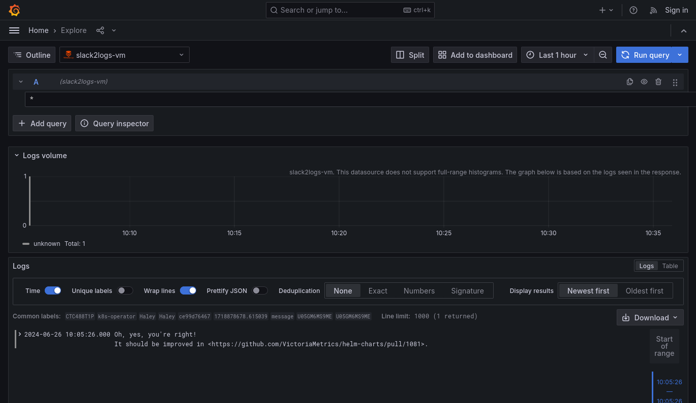

# victorialogs-rpm
RPM for victorialogs - [VictoriaLogs](https://docs.victoriametrics.com/VictoriaLogs/) is log management and log analytics system from [VictoriaMetrics](https://docs.victoriametrics.com/).

[](https://copr.fedorainfracloud.org/coprs/victoriametrics/VictoriaLogs/package/victorialogs/)

Before install disable [Selinux](https://selinuxproject.org/page/Main_Page).

## Installation with yum
Support CentOS 6, CentOS 7, Oraclelinux 7, Rhel 7

```
sudo yum -y install yum-plugin-copr
sudo yum -y copr enable victoriametrics/VictoriaLogs
sudo yum makecache
sudo yum -y install victorialogs
```

## Installation with dnf
Support CentOS-stream 8, CentOS-stream 9, CentOS 8, CentOS 9, Oraclelinux 8, Rhel 8, Rhel 9

```
sudo dnf -y install yum-plugin-copr
sudo dnf -y copr enable victoriametrics/VictoriaLogs
sudo dnf makecache
sudo dnf -y install victorialogs
```

## [VictoriaLogs datasource for Grafana](https://github.com/VictoriaMetrics/victorialogs-datasource)

The VictoriaLogs datasource plugin allows you to query and visualize [VictoriaLogs](https://docs.victoriametrics.com/victorialogs/) data in [Grafana](https://grafana.com).

- [Installation](https://github.com/VictoriaMetrics/victorialogs-datasource#installation)
- [Notes](https://github.com/VictoriaMetrics/victorialogs-datasource#notes)
- [License](https://github.com/VictoriaMetrics/victorialogs-datasource#license)

### Looking for a Demo without installation?

Just visit [https://play-grafana.victoriametrics.com/...](https://play-grafana.victoriametrics.com/explore?schemaVersion=1&panes=%7B%22pd1%22:%7B%22datasource%22:%22P566C6523BE02F42C%22,%22queries%22:%5B%7B%22refId%22:%22A%22,%22datasource%22:%7B%22type%22:%22victorialogs-datasource%22,%22uid%22:%22P566C6523BE02F42C%22%7D,%22expr%22:%22%2A%22,%22queryType%22:%22range%22%7D%5D,%22range%22:%7B%22from%22:%22now-1h%22,%22to%22:%22now%22%7D%7D%7D&orgId=1)

<p>
    <a href="#"></a>
</p>